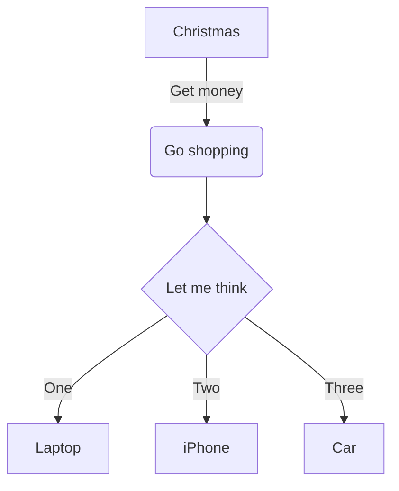
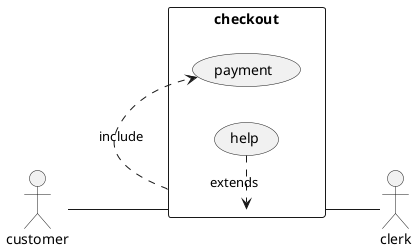

# Markdown

A *file* with **Markdown** content.

## With code blocks

```js
let a = 'a string value';

for (let char of a) {
    console.log(char);
}
```

```sql
SELECT * FROM table;
```

```
No language in this block
```

```sh
```

## With images

### Local


### Remote


### No content


### Unsafe path traversal


## With Mermaid graph



## With PlantUML graph



## External Link

[Google](https://google.com)

## Internal Link

[Other Page](other-page.md)

## Internal Link With absolute path

GitHub supports such paths, considering `/` to be the root of the repo

[Other Page](/test/fixtures/markdown/other-page.md)

## Internal with line break

What happens [if link description contains
a line break](other-page.md)?

## With tables

| Name    | Role      | Location    |
|---------|-----------|-------------|
| Alice   | Developer | New York    |
| Bob     | Designer  | Los Angeles |

### Table with alignment

| Left   | Center  | Right  |
|:-------|:-------:|-------:|
| L1     | C1      | R1     |
| L2     | C2      | R2     |

## With admonitions

!!! note
    This is a note admonition with **bold** text.

!!! warning "Custom Warning Title"
    This is a warning with a custom title.

!!! tip ""
    This tip has no title.

### Collapsible admonitions

??? note "Click to expand"
    This content is collapsed by default.

???+ info
    This content is expanded by default.

## Code blocks with attributes

```python title="main.py"
def hello():
    print("Hello, World!")
```

```js linenums="1"
const x = 1;
const y = 2;
```

```yaml title="config.yml" linenums="5"
server:
  port: 8080
  host: localhost
```

## Images with dimensions

{ width="300" }
